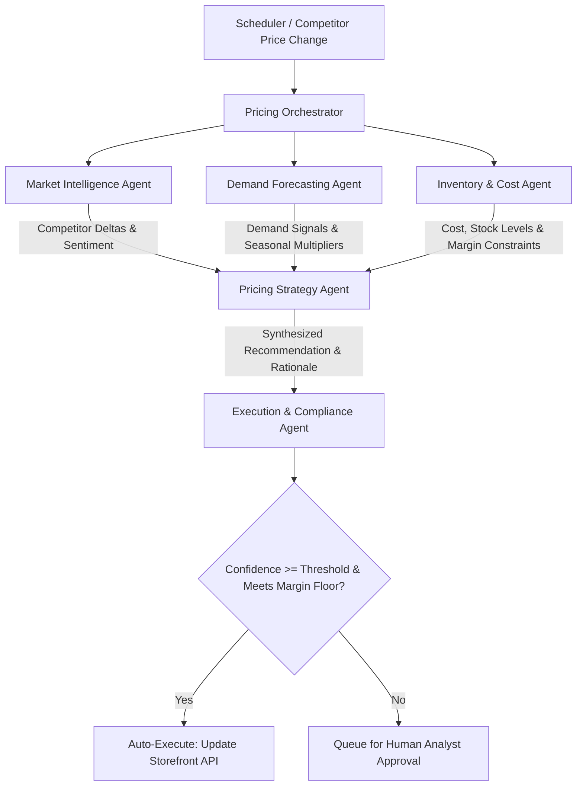
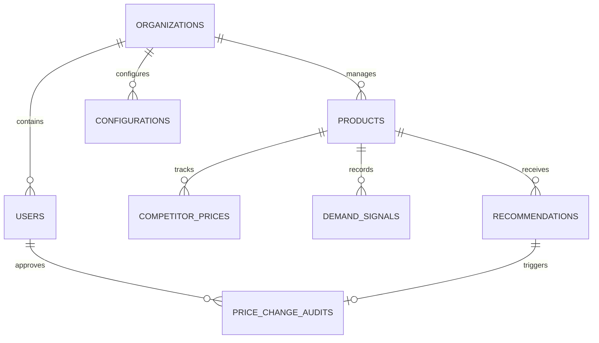

# Product Requirement Document (PRD)
## Dynamic Pricing Intelligence Dashboard (Option B)

| Attributes | Details |
|---|---|
| **Document Version** | 1.0.0 |
| **Status** | Draft (Ready for Review) |
| **Author** | Applied AI Engineering Team |
| **Target Stack** | FastAPI (Backend) + Next.js (Frontend) |
| **Project Root Folder** | `./` (Root workspace directory for codebase; `Docs/` is used for documentation only) |

---

## 1. Executive Summary & Business Context

### 1.1 Problem Statement
A mid-size e-commerce retailer managing **500+ SKUs** across multiple categories (electronics, home goods, apparel) currently reprices products manually on a weekly basis using spreadsheets. This manual, slow process results in:
*   **Revenue Leakage**: Estimated at 8–12% due to slow reactions to competitor price drops or market spikes.
*   **Inventory Imbalance**: Overstocking and subsequent heavy markdowns on slow-moving inventory, alongside stockouts on high-demand products.
*   **Lost Margin Opportunities**: Inability to dynamically capture demand surges during seasonal events, weekends, or viral trends.
*   **Operational Bottlenecks**: A pricing team of 6 analysts spending 70%+ of their time scraping data and managing spreadsheets instead of conducting strategic analysis.

### 1.2 Proposed Solution
Build a full-stack, multi-tenant web application featuring an **AI-powered Multi-Agent Pricing Engine** and a **Human-in-the-Loop (HITL) approval workflow**. The system will:
1.  **Monitor** competitor prices, demand signals, inventory levels, and margins in real-time (via mock APIs/scrapers).
2.  **Collaborate** using specialized AI agents to generate structured pricing recommendations with confidence scores and rationales.
3.  **Automate** low-risk, high-confidence price updates.
4.  **Involve** pricing analysts for high-impact or low-confidence updates through an elegant dashboard.
5.  **Audit** every manual and automated decision, feeding analyst feedback back into the agentic system.

---

## 2. User Roles & Multi-Tenant Architecture

Multi-tenancy is a core architectural requirement. The application must support absolute data isolation between different organizations.

### 2.1 Roles & Access Control (RBAC)
*   **Admin**:
    *   Configures system thresholds (auto-execution confidence score, margin floors per category).
    *   Manages SKUs/Products in the catalog.
    *   Invites team members and manages organization preferences.
    *   Has read/write access to all catalog, recommendation, audit, and configuration data.
*   **Pricing Analyst**:
    *   Views the product catalog and pricing recommendation queues.
    *   Acts on recommendations: approves, modifies, or rejects them (with a specified reason).
    *   Views the Audit Trail of price changes.
    *   Cannot modify system configurations (thresholds, margin floors).

### 2.2 Multi-Tenant Requirements
*   **Data Isolation**: Every database table containing tenant-specific data (users, products, recommendations, audits, configs) must contain an `org_id` column.
*   **API Context Enrichment**: Every incoming request must be parsed by backend middleware (e.g., FastAPI dependency or middleware) that extracts the user's identity and bounds all database queries strictly to their `org_id`.
*   **Onboarding Flow**:
    *   Create organization (generates unique `org_id` and optional join code).
    *   Sign up / log in with email/password (JWT-based).
    *   Invite codes for team members to join an existing organization.

---

## 3. Product Catalog & Dashboard (UI/UX)

The user interface should feel highly premium, modern, and information-dense, utilizing dark mode elements, smooth transitions, and charts.

### 3.1 Views & Pages
1.  **Authentication & Onboarding**: Clean, minimal login/registration and organization onboarding page.
2.  **Product Catalog Dashboard (Main View)**:
    *   A comprehensive, searchable table of all 500+ SKUs.
    *   Columns: SKU Code, Product Name, Category, Stock Level, Unit Cost (COGS), Current Price, Competitor Average Price, Current Margin (%), AI Recommendation Status.
    *   Features: Sort by margin or price delta; filter by category, stock status (low/healthy/overstocked), and recommendation status (pending, approved, rejected, auto-executed).
3.  **Recommendations Queue & Detail Panel**:
    *   Split-screen or drawer view showing pending adjustments.
    *   **Recommendation Card**: Shows SKU, old price, proposed price, margin impact, confidence score, and agent reasoning.
    *   **Detail Panel (Explainability)**: Visible breakdown of each agent's contribution (Market, Demand, Inventory, Compliance) and an interactive chart showing historical pricing vs. competitor pricing.
4.  **Audit Trail Log**:
    *   Filterable list of all price modifications. Shows timestamp, SKU, old price, new price, approval type (Auto / Approved by Analyst / Manual Override), and the user's name (if manual).
5.  **Admin Config Panel**:
    *   Auto-execution confidence threshold slider (e.g., auto-execute if confidence $\ge$ 85%).
    *   Margin floors (%) per category (e.g., Electronics $\ge$ 10%, Apparel $\ge$ 25%).
    *   E-commerce update simulator toggles.

---

## 4. AI Pricing Engine (Multi-Agent System)

The core pricing system utilizes a multi-agent workflow. To ensure the candidate can easily explain and defend the architecture in the live interview, we recommend a **custom asynchronous agent orchestrator** rather than a bloated framework.



### 4.1 Agent Responsibilities
1.  **Market Intelligence Agent**:
    *   **Input**: Competitor price data, raw news, or web search text.
    *   **Action**: Ingests, normalizes, and calculates price index/deltas relative to competitors.
    *   **Output**: Normalized competitor positioning and news sentiment (Positive/Neutral/Negative).
2.  **Demand Forecasting Agent**:
    *   **Input**: Sales history, Google Trends signals, seasonal metadata.
    *   **Action**: Predicts elasticity, velocity of the SKU, and seasonal demand multipliers.
    *   **Output**: Projected demand impact (High/Medium/Low) and trend multipliers.
3.  **Inventory & Cost Agent**:
    *   **Input**: Current stock level, replenishment lead time, COGS, margin thresholds.
    *   **Action**: Evaluates stock status. If inventory is critically low (risk of stockout), flags constraint to increase margin. If overstocked, flags constraint to drop price.
    *   **Output**: Dynamic minimum margin constraints and stock flags.
4.  **Pricing Strategy Agent (The Orchestrator)**:
    *   **Input**: Outputs from Market, Demand, and Inventory agents.
    *   **Action**: Synthesizes inputs using an LLM. Calculates the optimal recommendation price and confidence score.
    *   **Output**: Proposed Price, Confidence Score, and Structured Rationale.
5.  **Execution & Compliance Agent**:
    *   **Input**: Proposed Recommendation, Admin Configuration (Thresholds and Floors).
    *   **Action**: Validates the price doesn't breach the category's margin floor.
    *   **Output**: Routing decision: `AUTO_EXECUTED` (if confidence $\ge$ threshold) or `PENDING_REVIEW` (if confidence < threshold or needs review).

---

## 5. Relational Database Schema

Below is the database schema to support multi-tenancy, catalogs, agent outputs, and audit logs.



### 5.1 Tables Definition (SQLAlchemy/PostgreSQL compatible)

```sql
-- 1. Organizations
CREATE TABLE organizations (
    id UUID PRIMARY KEY DEFAULT gen_random_uuid(),
    name VARCHAR(255) NOT NULL,
    created_at TIMESTAMP WITH TIME ZONE DEFAULT CURRENT_TIMESTAMP
);

-- 2. Users (RBAC)
CREATE TABLE users (
    id UUID PRIMARY KEY DEFAULT gen_random_uuid(),
    org_id UUID NOT NULL REFERENCES organizations(id) ON DELETE CASCADE,
    email VARCHAR(255) UNIQUE NOT NULL,
    hashed_password VARCHAR(255) NOT NULL,
    full_name VARCHAR(255) NOT NULL,
    role VARCHAR(50) NOT NULL, -- 'ADMIN', 'ANALYST'
    created_at TIMESTAMP WITH TIME ZONE DEFAULT CURRENT_TIMESTAMP
);

-- 3. Configurations
CREATE TABLE configurations (
    id UUID PRIMARY KEY DEFAULT gen_random_uuid(),
    org_id UUID UNIQUE NOT NULL REFERENCES organizations(id) ON DELETE CASCADE,
    auto_execute_threshold FLOAT NOT NULL DEFAULT 0.85,
    category_margin_floors JSONB NOT NULL, -- e.g. {"electronics": 0.10, "apparel": 0.25}
    updated_at TIMESTAMP WITH TIME ZONE DEFAULT CURRENT_TIMESTAMP
);

-- 4. Products (SKU Catalog)
CREATE TABLE products (
    id UUID PRIMARY KEY DEFAULT gen_random_uuid(),
    org_id UUID NOT NULL REFERENCES organizations(id) ON DELETE CASCADE,
    sku VARCHAR(100) NOT NULL,
    name VARCHAR(255) NOT NULL,
    category VARCHAR(100) NOT NULL,
    current_price DECIMAL(10,2) NOT NULL,
    cogs DECIMAL(10,2) NOT NULL,
    inventory_count INTEGER NOT NULL DEFAULT 0,
    margin_threshold FLOAT NOT NULL DEFAULT 0.15, -- Minimum product margin threshold
    created_at TIMESTAMP WITH TIME ZONE DEFAULT CURRENT_TIMESTAMP,
    CONSTRAINT unique_sku_per_org UNIQUE(org_id, sku)
);

-- 5. Competitor Prices (Simulated Feed)
CREATE TABLE competitor_prices (
    id UUID PRIMARY KEY DEFAULT gen_random_uuid(),
    product_id UUID NOT NULL REFERENCES products(id) ON DELETE CASCADE,
    competitor_name VARCHAR(100) NOT NULL,
    price DECIMAL(10,2) NOT NULL,
    fetched_at TIMESTAMP WITH TIME ZONE DEFAULT CURRENT_TIMESTAMP
);

-- 6. Demand Signals (Simulated Feed)
CREATE TABLE demand_signals (
    id UUID PRIMARY KEY DEFAULT gen_random_uuid(),
    product_id UUID NOT NULL REFERENCES products(id) ON DELETE CASCADE,
    trend_score FLOAT NOT NULL DEFAULT 1.0, -- Google Trends metric simulation
    velocity_sales_30d INTEGER NOT NULL DEFAULT 0,
    seasonal_multiplier FLOAT NOT NULL DEFAULT 1.0,
    updated_at TIMESTAMP WITH TIME ZONE DEFAULT CURRENT_TIMESTAMP
);

-- 7. Recommendations
CREATE TABLE recommendations (
    id UUID PRIMARY KEY DEFAULT gen_random_uuid(),
    org_id UUID NOT NULL REFERENCES organizations(id) ON DELETE CASCADE,
    product_id UUID NOT NULL REFERENCES products(id) ON DELETE CASCADE,
    recommended_price DECIMAL(10,2) NOT NULL,
    confidence_score FLOAT NOT NULL,
    status VARCHAR(50) NOT NULL, -- 'PENDING', 'APPROVED', 'REJECTED', 'AUTO_EXECUTED'
    rejection_reason TEXT,
    agent_rationale JSONB NOT NULL, -- Individual agent reports: {market_agent: {...}, demand_agent: {...}, ...}
    suggested_at TIMESTAMP WITH TIME ZONE DEFAULT CURRENT_TIMESTAMP,
    reviewed_at TIMESTAMP WITH TIME ZONE,
    reviewed_by UUID REFERENCES users(id)
);

-- 8. Price Change Audit Trail
CREATE TABLE price_change_audits (
    id UUID PRIMARY KEY DEFAULT gen_random_uuid(),
    org_id UUID NOT NULL REFERENCES organizations(id) ON DELETE CASCADE,
    product_id UUID NOT NULL REFERENCES products(id) ON DELETE CASCADE,
    recommendation_id UUID REFERENCES recommendations(id) ON DELETE SET NULL,
    old_price DECIMAL(10,2) NOT NULL,
    new_price DECIMAL(10,2) NOT NULL,
    changed_by UUID REFERENCES users(id), -- NULL if auto-executed
    change_type VARCHAR(50) NOT NULL, -- 'AUTO', 'APPROVED', 'MANUAL_OVERRIDE'
    changed_at TIMESTAMP WITH TIME ZONE DEFAULT CURRENT_TIMESTAMP
);
```

---

## 6. API Design & Endpoints

### 6.1 Authentication API (`/api/auth`)
*   `POST /auth/register` - Create user and organization.
*   `POST /auth/login` - Returns JWT token and user metadata.
*   `POST /auth/invite` - (Admin only) Generates user signup invitation details.

### 6.2 Products API (`/api/products`)
*   `GET /products` - Get SKU catalog (paginated, filterable, searchable).
*   `POST /products` - (Admin only) Add new SKU.
*   `PUT /products/{id}` - (Admin only) Update SKU details.
*   `DELETE /products/{id}` - (Admin only) Delete SKU.

### 6.3 Recommendations API (`/api/recommendations`)
*   `GET /recommendations` - List recommendations (default filters to `PENDING`).
*   `GET /recommendations/{id}` - Details with agent logs and rationale.
*   `POST /recommendations/{id}/approve` - Accept AI price (updates product storefront).
*   `POST /recommendations/{id}/reject` - Reject price with reason.
*   `POST /recommendations/{id}/modify` - Override with manually typed price (updates product storefront).

### 6.4 System Configurations API (`/api/config`)
*   `GET /config` - Fetch organizational threshold levels.
*   `PUT /config` - (Admin only) Update thresholds and margin floors.

### 6.5 Auditing & Analytics API (`/api/audits`)
*   `GET /audits` - Fetch price change history logs.

---

## 7. Data Simulation & Mock Interfaces

Since this runs on mock data, we must provide realistic generators and web hooks.

1.  **Competitor Price Scraper Simulator**:
    *   A Python script (`scripts/simulate_competitors.py`) that runs on a schedule or manual trigger.
    *   Simulates price drops, price hikes, and stock-outs for 5-10 specific competitor brands.
2.  **Trend Data Simulator**:
    *   Simulates Google Trends metrics, weekends, and holidays to drive demand fluctuations.
3.  **Mock Storefront API Endpoint**:
    *   `POST /api/mock-storefront/update-price`
    *   Simulates the client's actual e-commerce store (Shopify/Magento).
    *   Allows toggleable failure states (e.g., 500 error, network timeout) to demonstrate the **rollback and failure compliance** logic of the Execution Agent.

---

## 8. Frontend Design & Aesthetic Guidelines

Following the guidelines for visual excellence:
*   **Colors**: Sleek dark mode primary palette (`bg: #09090b`, `card: #18181b`). Curated HSL colors (`hsl(262.1 83.3% 57.8%)` for active highlights, dynamic indicator states: positive margin in emerald `emerald-500`, drops in crimson `red-500`).
*   **Typography**: Google Font (e.g., *Inter* or *Outfit*).
*   **Aesthetics**: Glassmorphism dashboard cards with subtle borders (`rgba(255, 255, 255, 0.08)`), micro-animations for hover states, and loading skeletons.
*   **Visual Assets**: High-fidelity line/area charts showing price historical timelines (current, competitor, proposed) using lightweight charting library like `recharts` or custom SVG elements.

---

## 9. Non-Functional Requirements & Security

1.  **Strict Tenant Boundaries**: Enforce a global database query decorator or middleware in FastAPI checking for `org_id` context. A unit test suite should validate that Organization A cannot view Organization B's products.
2.  **AI Error Resilience**: If the LLM call fails, has rate-limits, or times out, the system must fallback gracefully to standard business rules (e.g., cost-plus pricing) and write an audit event indicating `LLM_OFFLINE_FALLBACK`.
3.  **Audit Security**: Price changes can only be logged via database transactions. Writing to `products.current_price` must trigger an automatic `price_change_audits` insertion inside the same DB transaction.

---

## 10. Implementation Plan & Phasing

To build this systematically within a short development cycle:

```markdown
- [ ] **Phase 1: DB Schema & Auth Foundation**
  - Initialize FastAPI backend structure with SQLite/PostgreSQL.
  - Setup SQLAlchemy models for all 8 entities.
  - Build tenant isolation middleware and JWT authentication routes.
- [ ] **Phase 2: Simulation Scripts & Seed Data**
  - Implement competitor price and trend simulators.
  - Seed catalog with 500+ SKUs across electronics, apparel, and home goods.
  - Build mock storefront updating API with toggleable failures.
- [ ] **Phase 3: Multi-Agent Logic Implementation**
  - Build the async agent framework class.
  - Implement LLM prompts for Market, Demand, Inventory, Strategy, and Compliance agents.
  - Validate pricing output constraints through automated unit tests.
- [ ] **Phase 4: Next.js Dashboard UI Development**
  - Scaffold Next.js application with dark mode theme.
  - Create SKU catalog dashboard with rich filtering, search, and margin visual tags.
  - Design the recommendation detail drawer with charts and agent logs.
- [ ] **Phase 5: Integration & Full Audit Controls**
  - Connect HitL action buttons (Approve/Reject/Modify) with the database transactions.
  - Build the audit trail view and admin threshold configuration page.
- [ ] **Phase 6: Testing & Production Readiness**
  - Add integration tests verifying multi-tenant data leaks do not occur.
  - Write detailed setup instructions (Docker Compose) in the README.md.
```

---
*End of PRD*
