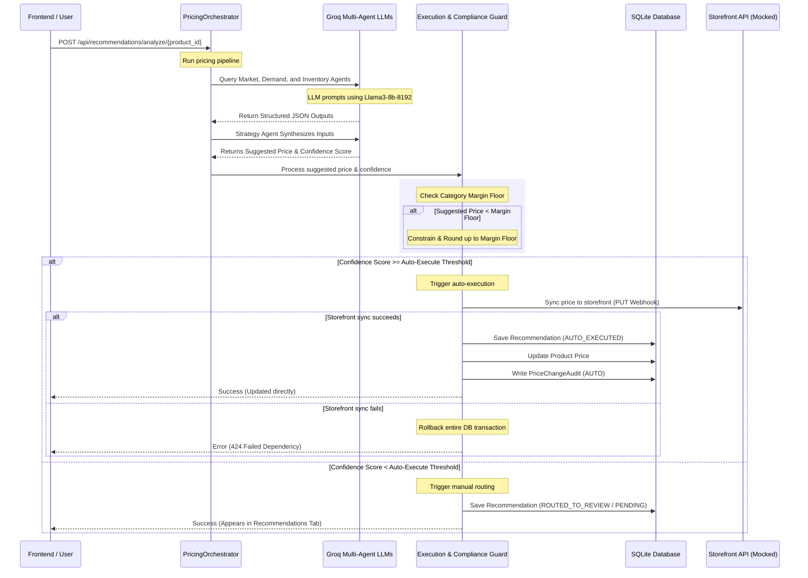

# PriceMatrix AI - System & Interaction Description

This document provides a comprehensive guide to the **PriceMatrix AI** platform. It details user roles, frontend interactive buttons, backend route triggers, and the lifecycle of the AI multi-agent pricing engine.

---

## 1. User Roles & Permission Map

The application enforces strict Role-Based Access Control (RBAC) to separate duties between administrators and analysts.

| Action / Capability | Workspace Admin (`ADMIN`) | Pricing Analyst (`ANALYST`) | Backend Middleware Rule |
| :--- | :---: | :---: | :--- |
| **View SKU Catalog** | Yes | Yes | `Depends(get_current_user)` |
| **Add New SKU** | **Yes** | No | `Depends(require_role(["ADMIN"]))` |
| **Edit Catalog SKU** | **Yes** | No | `Depends(require_role(["ADMIN"]))` |
| **Delete Catalog SKU** | **Yes** | No | `Depends(require_role(["ADMIN"]))` |
| **Trigger AI Analysis** | Yes | Yes | `Depends(get_current_user)` |
| **View Recommendations Queue** | Yes | Yes | `Depends(get_current_user)` |
| **Approve / Reject Recommendation** | Yes | Yes | `Depends(get_current_user)` |
| **Manual Price Override** | Yes | Yes | `Depends(get_current_user)` |
| **View Audit Logs** | Yes | Yes | `Depends(get_current_user)` |
| **Update System Configurations** | **Yes** | No (Read-only UI) | `Depends(require_role(["ADMIN"]))` |

---

## 2. Frontend Buttons & User Actions (Tab-by-Tab Breakdown)

The dashboard is structured into four main workspace tabs. The buttons and controls present in each tab behave as follows:

### Login & Registration Screen
*   **"Sign In" Button:** Authenticates the user's email and password. On success, stores the JWT token and user metadata in `localStorage`, updates the React state to authenticated, and displays the main dashboard.
*   **"Register Workspace" Button:** Creates a new Organization workspace (with default pricing configuration tables) and registers the user as the initial Workspace Admin. Alternatively, users can join an existing organization by pasting an existing Org UUID.
*   **"Sign Out" Button (Header):** Cleans up authorization headers, clears `localStorage`, resets React states, and redirects the user back to the login screen.

### Tab 1: SKU Catalog
This tab displays the products owned by the active user's organization.
*   **"Add SKU" Button (Admin Only):** Opens a popup modal allowing the administrator to add new products to the catalog (requires SKU, Name, Category, Price, COGS, Inventory Count, and Margin Threshold). Triggers `POST /api/products`.
*   **"Trigger AI Analysis" Button:** Triggers the multi-agent pipeline for that specific product row. Triggers `POST /api/recommendations/analyze/{product_id}`. Displays a success notification upon completion.
*   **"Edit" (Pencil Icon) Button (Admin Only):** Opens a modal to edit the selected product's name, category, price, cost of goods sold, inventory count, and margin thresholds. Triggers `PUT /api/products/{id}`.
*   **"Delete" (Trash Icon) Button (Admin Only):** Prompts the admin for confirmation, then deletes the product from the organization's catalog. Triggers `DELETE /api/products/{id}`.
*   **Filters & Search Inputs:** Dynamically re-queries the backend `GET /api/products` with filters for Search Keywords, Category (Electronics, Apparel, Home Goods), Stock Status (Critically Low, Healthy, Overstocked), and sorting order.

### Tab 2: Recommendations Queue
This tab shows pending price adjustments calculated by the AI engine.
*   **Row Click / "View Details" Link:** Opens a right-side sliding Drawer displaying the detailed analysis results, overall confidence score, compliance logs, and individual agent rationale metrics.
*   **"Approve Recommendation" Button (Inside Drawer):** Triggers `POST /api/recommendations/{id}/approve`.
    *   *Backend Action:* Initiates a simulated external storefront API sync (e.g. updating Shopify/WooCommerce). On success, marks the recommendation status as `APPROVED`, writes the new price to the database, and adds a `PriceChangeAudit` log marked as `APPROVED` with the user's ID.
*   **"Reject Recommendation" Button (Inside Drawer):** Displays a rejection reasoning textbox. Submitting triggers `POST /api/recommendations/{id}/reject`.
    *   *Backend Action:* Marks the recommendation status as `REJECTED` and writes the provided text to the `rejection_reason` database column. The product's price remains unchanged.
*   **"Manual Override Price" Button (Inside Drawer):** Displays a decimal price input. Submitting triggers `POST /api/recommendations/{id}/modify` with the override price.
    *   *Backend Action:* Validates that the custom price does not breach the organization's category margin floor. If valid, syncs the custom price with the storefront. On success, updates the product price in the DB, sets the recommendation status to `APPROVED`, and writes a `PriceChangeAudit` log marked as `MANUAL_OVERRIDE`.

### Tab 3: Audit Trail
A read-only timeline tracking pricing adjustments.
*   **Refresh/Load Action:** Queries `GET /api/audits`. Lists all price changes, showing the SKU/Product, Old Price, New Price, Change Type (`AUTO` vs `APPROVED` vs `MANUAL_OVERRIDE`), Timestamp, and the Email of the user who authorized the change.

### Tab 4: System Configurations
Configure safety thresholds and profit margins.
*   **Auto-Execute Threshold Slider (Admin Only):** Sets the confidence score cutoff (0.0 to 1.0) above which recommendations automatically bypass manual review and execute.
*   **Category Margin Floor Sliders (Admin Only):** Sets the minimum margin percentage allowed for Electronics, Apparel, and Home Goods categories.
*   **"Save Configuration" Button (Admin Only):** Persists configuration changes to the database. Triggers `PUT /api/config`.
*   *Note for Analysts:* Sliders and inputs are disabled and displayed as read-only. Analysts cannot modify or submit configuration updates.

---

## 3. Background Multi-Agent Engine Lifecycle (Under the Hood)

When a user clicks **"Trigger AI Analysis"** for a product SKU, the following backend sequence is executed:

### Detailed Agent Roles

1.  **Market Intelligence Agent:** Analyzes product competitor histories in the database. Calls the Groq API (model `llama3-8b-8192`) to determine overall market sentiment (`POSITIVE`/`NEUTRAL`/`NEGATIVE`) and returns average competitor prices.
2.  **Demand Forecasting Agent:** Checks category search metrics (mocked Google Trends signals). Predicts demand elasticity and trends to recommend upward or downward price adjustments.
3.  **Inventory Cost Agent:** Reviews stock levels (Critically Low `inventory <= 10`, Overstocked `inventory > 100`, Healthy). Generates stock status pressure logs and holding cost impact reports.
4.  **Strategy Orchestrator Agent:** Gathers output from the Market, Demand, and Inventory agents. Calls Groq to evaluate the inputs, calculate the final suggested price, assign a confidence score (from `0.0` to `1.0`), and write the final strategy reasoning.
5.  **Execution & Compliance Agent (Safety Boundary):**
    *   Calculates the minimum allowed price using:
        $$\text{Margin Floor Price} = \frac{\text{COGS}}{1 - \text{Margin Floor}}$$
    *   If the strategy's suggested price falls below the floor, the compliance guard adjusts it up to the margin floor.
    *   Compares the confidence score against the workspace **Auto-Execute Threshold**:
        *   **High Confidence:** Storefront synchronization is attempted. If successful, updates the database and logs the audit trail under type `AUTO`. If it fails, database changes are rolled back.
        *   **Low Confidence:** Creates a recommendation in `PENDING` status, routing it to the manual queue in the frontend.
